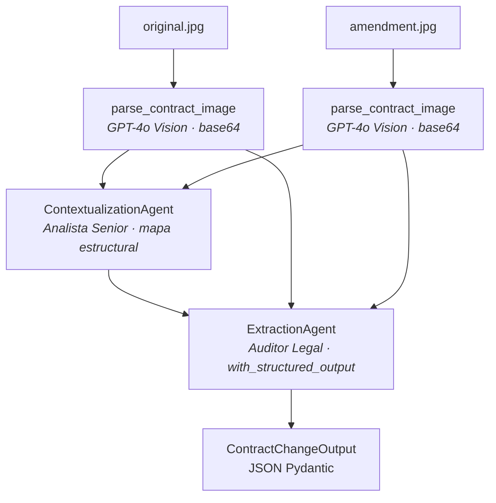
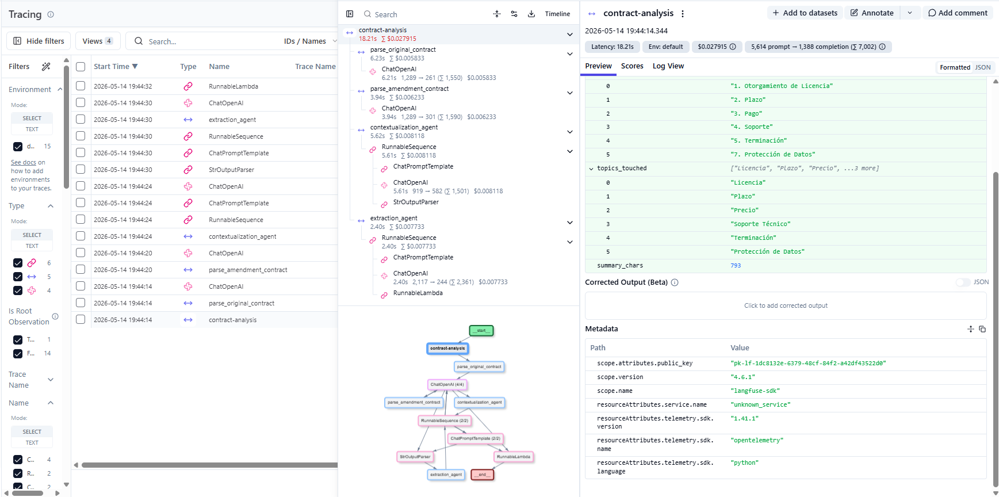

# Contract Change Detector

Sistema multi-agente autónomo que compara la imagen escaneada de un **contrato original** con su **enmienda (adenda)** y devuelve un JSON estrictamente validado describiendo cada cambio. Construido para el proyecto final del Módulo 4 del bootcamp **Henry AI Engineering** (caso LegalMove).

El cliente ficticio es *LegalMove*, una empresa de tecnología legal cuyo equipo de Compliance gasta más de 40 horas semanales haciendo esta comparación manualmente. El sistema reemplaza ese proceso con un pipeline auditable y rico en observabilidad.

## Arquitectura



Fallback ASCII:

```
   original.jpg            amendment.jpg
        |                       |
        v                       v
 parse_contract_image    parse_contract_image      <- GPT-4o Vision (data URL base64)
        |                       |
        +-----------+-----------+
                    v
       ContextualizationAgent                       <- "Analista Senior"
       (mapa estructural: secciones alineadas, sin cambios todavía)
                    |
                    v
       ExtractionAgent                              <- "Auditor Legal Forense"
       with_structured_output(ContractChangeOutput) <- structured outputs de OpenAI
                    |
                    v
            JSON Pydantic
```

### Jerarquía de spans en Langfuse

Cada ejecución se captura bajo un span raíz (`contract-analysis`) con cuatro spans hijos nombrados; cada uno contiene un `generation` anidado de `ChatOpenAI` que produce automáticamente el `CallbackHandler` de LangChain:

```
contract-analysis (span raíz — abierto en main.py)
├── parse_original_contract       (span)
│   └── ChatOpenAI                (generation — imagen + texto extraído, tokens, latencia)
├── parse_amendment_contract      (span)
│   └── ChatOpenAI                (generation)
├── contextualization_agent       (span — output: preview del mapa estructural)
│   └── ChatOpenAI                (generation)
└── extraction_agent              (span — output: JSON final)
    └── ChatOpenAI                (generation — structured output)
```

Una captura de una traza completa se encuentra abajo:



## Estructura del proyecto

```
.
├── README.md
├── GUIA.md                  (guía de estudio detallada del proyecto)
├── pyproject.toml          (gestionado con uv + config de ruff)
├── requirements.txt        (exportado desde el lockfile de uv)
├── .env.example            (OPENAI_API_KEY, LANGFUSE_*)
├── .env                    (gitignored)
├── docs/
│   └── langfuse_trace.png  (captura de una traza completa)
├── data/
│   └── test_contracts/     (3 pares de JPGs + README documentando los cambios esperados)
└── src/
    ├── main.py             (argparse, abre el span raíz de Langfuse, secuencia el pipeline)
    ├── image_parser.py     (base64 + HumanMessage multimodal a GPT-4o Vision)
    ├── models.py           (ContractChangeOutput de Pydantic)
    ├── agents/
    │   ├── contextualization_agent.py   (Agente 1 — mapa estructural)
    │   └── extraction_agent.py          (Agente 2 — with_structured_output)
    └── shared/
        ├── config.py          (loader de .env + accesores tipados de credenciales)
        ├── logger.py          (logger con Rich)
        └── observability.py   (factory del cliente Langfuse + CallbackHandler)
```

## Setup

Requiere Python 3.11+ y [uv](https://docs.astral.sh/uv/) (`pipx install uv`, `brew install uv` o `winget install astral-sh.uv`). Si preferís `pip`, mirá la nota *Alternativa con pip* más abajo.

```bash
# 1. Instalar dependencias
uv sync

# 2. Configurar credenciales
cp .env.example .env
# Editar .env con tus OPENAI_API_KEY, LANGFUSE_PUBLIC_KEY, LANGFUSE_SECRET_KEY.
# El LANGFUSE_HOST por default es la cloud de US — cambiar a https://cloud.langfuse.com para EU.

# 3. Correr sobre uno de los pares de prueba
uv run python src/main.py data/test_contracts/contract_1_original.jpg data/test_contracts/contract_1_amendment.jpg
```

> **Alternativa con pip:** `python -m venv .venv && .venv/Scripts/activate && pip install -r requirements.txt` (Linux/macOS: `source .venv/bin/activate`). Después se omite el prefijo `uv run`.

> **Nota Windows + OneDrive:** si el repo vive en una carpeta sincronizada con OneDrive, prefijá los comandos uv con `UV_LINK_MODE=copy` y opcionalmente `UV_PROJECT_ENVIRONMENT=C:/Temp/aem4-venv` para mantener el `.venv` fuera de OneDrive. OneDrive interfiere con los hardlinks durante la instalación de dependencias.

## Uso

El entry point recibe dos argumentos posicionales — la ruta al contrato original y la ruta a la enmienda, en ese orden:

```bash
# Par 1 — Licencia de Software (5 cambios, incluyendo nueva cláusula "Protección de Datos")
uv run python src/main.py \
  data/test_contracts/contract_1_original.jpg \
  data/test_contracts/contract_1_amendment.jpg

# Par 2 — Consultoría (5 cambios, incluyendo nueva cláusula "Propiedad Intelectual")
uv run python src/main.py \
  data/test_contracts/contract_2_original.jpg \
  data/test_contracts/contract_2_amendment.jpg

# Par 3 — SaaS (3 cambios más simples, sin cláusulas nuevas)
uv run python src/main.py \
  data/test_contracts/contract_3_original.jpg \
  data/test_contracts/contract_3_amendment.jpg
```

Flags:
- `--no-langfuse` desactiva el tracing de Langfuse (debug offline; el pipeline corre igual).

Códigos de salida:
- `0` éxito — JSON impreso por stdout
- `1` `ValidationError` de Pydantic (el extractor devolvió JSON malformado)
- `2` error de IO / archivo no soportado / error de API tras los reintentos

Mirá [`data/test_contracts/README.md`](data/test_contracts/README.md) para los cambios esperados de cada par (ground truth del bootcamp).

## Justificaciones técnicas

Esta sección anticipa las cuatro preguntas estándar de la defensa.

### 1. ¿Por qué dos agentes en lugar de uno monolítico?

Separar **contextualización** de **extracción** imita la forma en que trabajaría un equipo legal real: un analista senior primero establece qué secciones de los dos documentos se corresponden, y recién entonces un auditor forense recorre sección por sección enumerando las diferencias concretas. Beneficios en el código:

- **Prompts más cortos y focalizados** — cada agente tiene 4-5 responsabilidades numeradas en lugar de un único prompt intentando hacer todo. Menos drift de prompt, menos cambios alucinados.
- **Handoff inspectable** — el mapa estructural que produce el ContextualizationAgent es Markdown plano; durante el debug podés leerlo y ver si el modelo desalineó alguna sección antes de que el auditor entrara en acción.
- **Observabilidad más limpia** — cada agente tiene su propio span en Langfuse; los tokens, la latencia y los outputs quedan atribuidos por etapa en lugar de mezclados en una sola llamada.

### 2. ¿Por qué GPT-4o para el parsing de visión?

GPT-4o es actualmente el modelo mainstream más fuerte en:

- **OCR en español** sobre escaneos de documentos (las imágenes del bootcamp están en español).
- **Extracción jerárquica** — cláusulas numeradas, sub-numeración (1.1, 1.2), orden original de los párrafos.
- **Razonamiento + transcripción en una sola llamada** — la misma invocación que "ve" los píxeles también obedece nuestra instrucción de "preservar numeración y jerarquía, sin comentarios", eliminando la necesidad de un pase de limpieza posterior.

Un pipeline solo de OCR (Tesseract, AWS Textract) perdería las pistas de layout y requeriría un segundo LLM para reestructurar el texto. El round-trip de dos etapas costaría aproximadamente lo mismo en tokens y agregaría latencia.

### 3. ¿Cómo están diseñados los prompts?

- **Role priming** — el system prompt de cada agente arranca con `"Eres un Analista Senior..."` / `"Eres un Auditor Legal Forense..."`. Los roles específicos guían tono y rigor de manera confiable en GPT-4o.
- **Responsabilidades numeradas** — listas con bullets de qué hacer *y* qué NO hacer (por ejemplo, contextualización dice explícitamente "NO TE CORRESPONDE describir los cambios en detalle").
- **Ejemplo one-shot para el extractor** — el system prompt muestra una muestra de JSON output para anclar al modelo en la forma y el estilo esperados (prosa en español, citas old → new).
- **`temperature=0`** — ejecuciones reproducibles para la defensa en vivo y para cruzar contra el documento ground-truth.
- **`Field(..., description=...)` rico en cada campo de Pydantic** — esas descripciones se envían a la API de structured outputs de OpenAI como el `description` JSON-schema de cada propiedad, así que GPT-4o las lee como parte de la guía de generación. Por eso la prosa en español del JSON sale idiomática sin instrucciones explícitas de formato dentro del user prompt.

### 4. ¿Cómo se manejan los errores?

Cuatro clases de fallo nombradas, sin catches genéricos más amplios:

| Clase | Dónde | Comportamiento |
| --- | --- | --- |
| `FileNotFoundError` / `ValueError` | `image_parser._encode_image` y validación de path | Surface inmediato, exit code 2. Sin paths de fallback — un fallback silencioso enmascararía el error de input del operador. |
| Error de encoding base64 | `try/except` en `_encode_image` | Captura + re-raise con contexto (qué archivo falló). |
| `openai.APITimeoutError` / `RateLimitError` | `ChatOpenAI(max_retries=2, timeout=60)` | Dos reintentos automáticos con backoff exponencial vía el SDK de OpenAI; si sigue fallando, exit code 2. El timeout de 60s (vs el default de 600s del SDK) hace que las llamadas de visión colgadas fallen rápido durante desarrollo. |
| `pydantic.ValidationError` | `extraction_agent.run` | Loggea los detalles del error de validación y re-raise. Exit code 1. Los structured outputs hacen esto casi imposible en la práctica, pero el catch está pedido por la rúbrica y es útil para el raro caso en que se amplíe el schema en un refactor futuro. |

Sin `try/except Exception: pass`, sin reintentos silenciosos más allá del que ya hace el SDK. El principio: un error visible al operador vale más que una corrida "exitosa" con basura adentro.

## Stack técnico

- **LLM:** OpenAI **GPT-4o** (`gpt-4o`) — usado tanto para el parsing de visión como para los dos agentes de texto
- **Framework:** **LangChain** (`langchain-openai`, `langchain-core`) — `ChatOpenAI`, chains LCEL, contenido multimodal de `HumanMessage`, `with_structured_output`, propagación de callbacks
- **Validación:** **Pydantic** (v2) con anotaciones `Field(description=...)` que se reenvían a los structured outputs de OpenAI
- **Observabilidad:** **Langfuse** v4 — `start_as_current_observation` explícito para los cuatro spans nombrados, `CallbackHandler` para captura automática de las generations del LLM
- **Manejo de env:** `python-dotenv`
- **Gestión de paquetes:** `uv` (con `requirements.txt` exportado para compatibilidad con pip)

## Limitaciones conocidas

- **Solo contratos de una página** — el corpus de demo tiene una página por archivo. Para PDFs multi-página harían falta pasos adicionales que dividan páginas en múltiples llamadas de parsing y concatenen el Markdown resultante.
- **Pipeline secuencial** — las dos llamadas de parsing de imágenes son secuenciales, no paralelas. Para volúmenes mayores podrían enviarse en paralelo con `asyncio.gather`.
- **Sin cola de revisión humana** — el sistema produce un JSON con confianza implícita 1.0 y asume automatización aguas abajo. Un deployment de producción gatillaría a un score de confianza y rutearía los casos de baja confianza a un paralegal humano.
- **Costo de tokens de visión** — GPT-4o Vision es la llamada más cara del pipeline (~$0.02 por página en detail por default). Un fallback más barato pero todavía aceptable sería `gpt-4o-mini` con `detail="low"` para triage inicial.

## Contexto del curso

Construido como **proyecto final (capstone) del Módulo 4 del bootcamp Henry AI Engineering**. El proyecto del Módulo 3 (RAG multi-dominio para ticket routing) está en [aem3-multi-agent-ticket-routing](https://github.com/maxi-micheli-hg/aem3-multi-agent-ticket-routing).

## Documentación adicional

Para una explicación a fondo del proyecto, recorrido archivo por archivo, decisiones técnicas detalladas, anatomía de una traza de Langfuse, Q&A anticipado para la defensa en vivo y glosario, leer [`GUIA.md`](GUIA.md).
