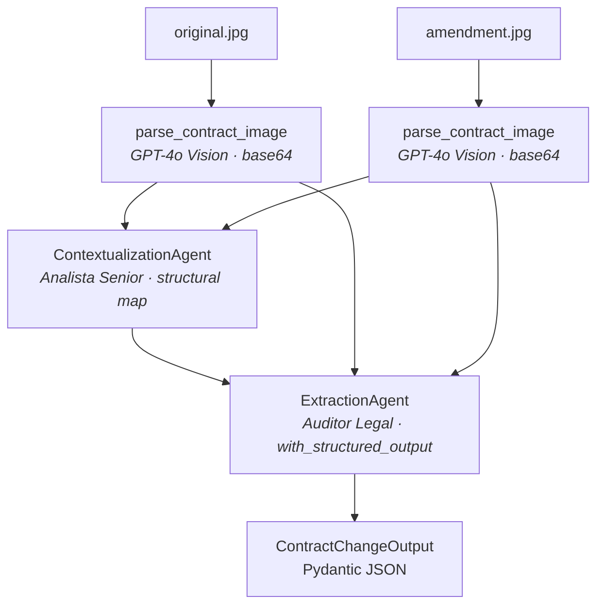

# Contract Change Detector

Autonomous multi-agent system that compares the scanned image of an **original contract** with its **amendment / adenda** and returns a strictly-validated JSON describing every change. Built for the **Henry AI Engineering** bootcamp's Module 4 final project (LegalMove case).

The fictional client is *LegalMove*, a legal-tech company whose compliance team spends 40+ weekly hours doing this comparison manually. The system replaces that with an auditable, observability-rich pipeline.

## Architecture



ASCII fallback:

```
   original.jpg            amendment.jpg
        |                       |
        v                       v
 parse_contract_image    parse_contract_image      <- GPT-4o Vision (base64 data URL)
        |                       |
        +-----------+-----------+
                    v
       ContextualizationAgent                       <- "Analista Senior"
       (structural map: sections aligned, no diffs)
                    |
                    v
       ExtractionAgent                              <- "Auditor Legal Forense"
       with_structured_output(ContractChangeOutput) <- OpenAI structured outputs
                    |
                    v
            Pydantic JSON
```

### Langfuse span hierarchy

Every run is captured under one root span (`contract-analysis`) with four named child spans, each holding a nested `ChatOpenAI` `generation` observation produced automatically by the LangChain callback handler:

```
contract-analysis (root span — opened in main.py)
├── parse_original_contract       (span)
│   └── ChatOpenAI                (generation — input image + extracted text, tokens, latency)
├── parse_amendment_contract      (span)
│   └── ChatOpenAI                (generation)
├── contextualization_agent       (span — structural map output preview)
│   └── ChatOpenAI                (generation)
└── extraction_agent              (span — final JSON output)
    └── ChatOpenAI                (generation — structured output)
```

A screenshot of one full trace is at [`docs/langfuse_trace.png`](docs/langfuse_trace.png).

## Project layout

```
.
├── README.md
├── pyproject.toml          (uv-managed deps + ruff config)
├── requirements.txt        (exported from uv lockfile)
├── .env.example            (OPENAI_API_KEY, LANGFUSE_*)
├── .env                    (gitignored)
├── docs/
│   └── langfuse_trace.png  (screenshot of one full trace)
├── data/
│   └── test_contracts/     (3 pairs of JPGs + README documenting expected diffs)
└── src/
    ├── main.py             (argparse, opens root Langfuse span, sequences the pipeline)
    ├── image_parser.py     (base64 + multimodal HumanMessage to GPT-4o Vision)
    ├── models.py           (Pydantic ContractChangeOutput)
    ├── agents/
    │   ├── contextualization_agent.py   (Agent 1 — structural map)
    │   └── extraction_agent.py          (Agent 2 — with_structured_output)
    └── shared/
        ├── config.py          (.env loader + typed credentials)
        ├── logger.py          (Rich logger)
        └── observability.py   (Langfuse client + CallbackHandler factory)
```

## Setup

Requires Python 3.11+ and [uv](https://docs.astral.sh/uv/) (`pipx install uv`, `brew install uv`, or `winget install astral-sh.uv`). If you prefer `pip`, see the *pip alternative* note below.

```bash
# 1. Install dependencies
uv sync

# 2. Configure credentials
cp .env.example .env
# Then edit .env with your OPENAI_API_KEY, LANGFUSE_PUBLIC_KEY, LANGFUSE_SECRET_KEY.
# Default LANGFUSE_HOST is the US cloud — change to https://cloud.langfuse.com for EU.

# 3. Run on one of the test pairs
uv run python src/main.py data/test_contracts/contract_1_original.jpg data/test_contracts/contract_1_amendment.jpg
```

> **pip alternative:** `python -m venv .venv && .venv/Scripts/activate && pip install -r requirements.txt` (Linux/macOS: `source .venv/bin/activate`). Then drop the `uv run` prefix.

> **Windows + OneDrive note:** if the repo lives in a OneDrive-synced folder, prefix uv commands with `UV_LINK_MODE=copy`, and optionally `UV_PROJECT_ENVIRONMENT=C:/Temp/aem4-venv` to keep `.venv` outside OneDrive. OneDrive interferes with hardlinks during dependency installation.

## Usage

The entry point takes two positional arguments — the path to the original contract image and the path to the amendment image — in that order:

```bash
# Pair 1 — Software License (5 changes incl. new "Protección de Datos" clause)
uv run python src/main.py \
  data/test_contracts/contract_1_original.jpg \
  data/test_contracts/contract_1_amendment.jpg

# Pair 2 — Consulting Services (5 changes incl. new "Propiedad Intelectual" clause)
uv run python src/main.py \
  data/test_contracts/contract_2_original.jpg \
  data/test_contracts/contract_2_amendment.jpg

# Pair 3 — SaaS Agreement (3 simpler changes, no new clauses)
uv run python src/main.py \
  data/test_contracts/contract_3_original.jpg \
  data/test_contracts/contract_3_amendment.jpg
```

Flags:
- `--no-langfuse` disables Langfuse for offline debugging (the pipeline still runs).

Exit codes:
- `0` success — JSON printed to stdout
- `1` Pydantic `ValidationError` (extractor returned malformed JSON)
- `2` IO / unsupported file / API error after retries

See [`data/test_contracts/README.md`](data/test_contracts/README.md) for the expected changes per pair (ground truth from the bootcamp).

## Technical justifications

This section anticipates the four standard defense questions.

### 1. Why two agents instead of one monolithic LLM call?

Separating **contextualization** from **extraction** mirrors how a real legal team works: a senior analyst first establishes which sections of the two documents correspond, then a forensic auditor goes section by section to enumerate concrete diffs. The benefits in code:

- **Smaller, focused prompts** — each agent has 4-5 numbered responsibilities instead of one prompt trying to do everything. Less prompt drift, fewer hallucinated changes.
- **Inspectable handoff** — the ContextualizationAgent's structural map is plain Markdown, so during debugging you can read it and see whether the model already misaligned a section before the auditor got involved.
- **Cleaner observability** — each agent has its own Langfuse span; tokens, latency, and outputs are attributed per stage rather than pooled into one fat call.

### 2. Why GPT-4o for the vision parsing?

GPT-4o is currently the strongest mainstream model at:

- **Spanish OCR** on document scans (the bootcamp's images are in Spanish).
- **Hierarchical extraction** — numbered clauses, sub-numbering (1.1, 1.2), preserved order of paragraphs.
- **Joint reasoning + transcription** — the same call that reads pixels also follows our "preserve numbering and hierarchy, no comments" instruction, removing the need for a separate cleanup pass.

A pure OCR pipeline (Tesseract, AWS Textract) would lose layout cues and require a second LLM to restructure the text. The two-stage round-trip would cost roughly the same in tokens and add latency.

### 3. How are the prompts designed?

- **Role priming** — each agent's system prompt opens with `"Eres un Analista Senior..."` / `"Eres un Auditor Legal Forense..."`. Specific named roles reliably steer GPT-4o's tone and rigor.
- **Numbered responsibilities** — bulleted lists of what to do *and* what NOT to do (e.g., contextualization explicitly says "NO TE CORRESPONDE describir los cambios en detalle").
- **One-shot example for the extractor** — the system prompt shows a sample JSON output so the model anchors on shape and style (Spanish prose, old→new value citations).
- **`temperature=0`** — reproducible runs for the live demo and for cross-checking against the ground-truth doc.
- **`Field(..., description=...)` on every Pydantic field** — these descriptions are forwarded to OpenAI's structured-outputs API as the JSON-schema `description` for each property, so GPT-4o reads them as part of its generation guidance. This is why the JSON's Spanish prose comes out idiomatic without explicit formatting instructions inside the user prompt.

### 4. How are errors handled?

Four named failure classes, no broader catches:

| Class | Where | Behavior |
| --- | --- | --- |
| `FileNotFoundError` / `ValueError` | `image_parser._encode_image` and path validation | Surface immediately, exit code 2. No fallback paths — silent fallback would mask the operator's input mistake. |
| Base64 encoding error | `_encode_image` `try/except` | Catch + re-raise with context (which file failed). |
| `openai.APITimeoutError` / `RateLimitError` | `ChatOpenAI(max_retries=2, timeout=60)` | Two automatic retries with exponential backoff via the OpenAI SDK; if still failing, exit code 2. The 60-second timeout (vs the SDK default of 600s) makes stuck vision calls fail fast during development. |
| `pydantic.ValidationError` | `extraction_agent.run` | Logs the validation error details and re-raises. Exit code 1. Structured outputs make this almost impossible in practice, but the catch is required by the rubric and useful for the rare case the schema is widened in a future refactor. |

No `try/except Exception: pass`, no silent retries beyond the SDK's built-in one. The principle: an error visible to the operator is more valuable than a "successful" run with garbage output.

## Tech stack

- **LLM:** OpenAI **GPT-4o** (`gpt-4o`) — used for both Vision parsing and the two text agents
- **Framework:** **LangChain** (`langchain-openai`, `langchain-core`) — `ChatOpenAI`, LCEL chains, `HumanMessage` multimodal content, `with_structured_output`, callback propagation
- **Validation:** **Pydantic** (v2) with `Field(description=...)` annotations forwarded to OpenAI structured outputs
- **Observability:** **Langfuse** v4 — explicit `start_as_current_observation` for the four named spans, `CallbackHandler` for automatic LLM generation capture
- **Env mgmt:** `python-dotenv`
- **Package management:** `uv` (with `requirements.txt` exported for pip compatibility)

## Known limitations

- **Single-page contracts only** — the demo corpus is one-page-each. Multi-page PDFs would need an extra step that splits pages into multiple parse calls and concatenates the resulting Markdown.
- **Synchronous pipeline** — the two image-parse calls are sequential, not parallel. For larger volumes they could be sent concurrently with `asyncio.gather`.
- **No human review queue** — the system produces a confidence-1.0 JSON and assumes downstream automation. A production deployment would gate on a confidence score and route low-confidence cases to a human paralegal.
- **Vision token cost** — GPT-4o Vision is the most expensive single call in the pipeline (~$0.02 per page at default detail). A cheaper-but-still-good fallback would be `gpt-4o-mini` with `detail="low"` for triage.

## Course context

Built as the **Henry AI Engineering bootcamp Module 4 final project** (capstone). The companion Module 3 project (multi-domain RAG ticket routing) lives at [aem3-multi-agent-ticket-routing](https://github.com/maxi-micheli-hg/aem3-multi-agent-ticket-routing).
